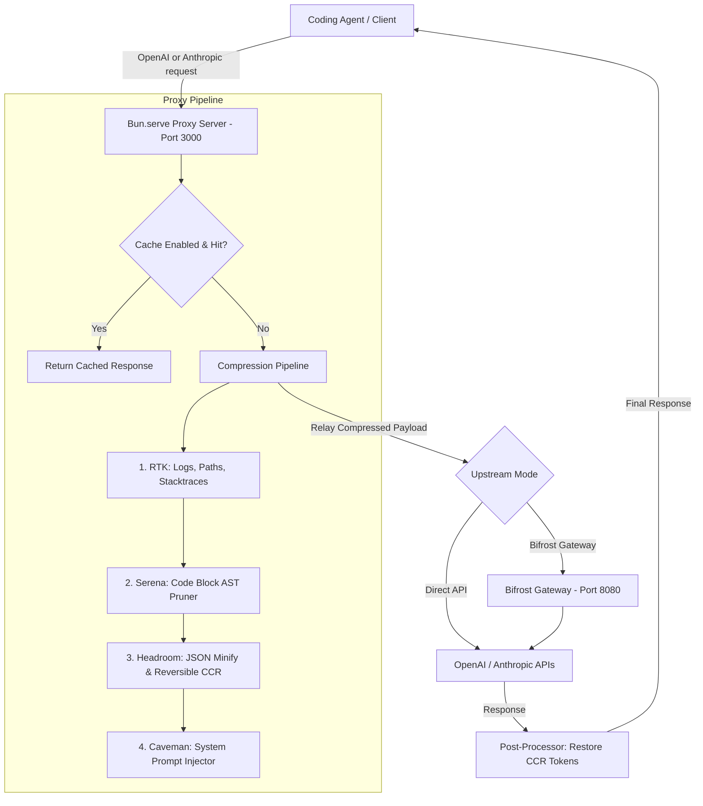

# 📋 Technical Implementation Plan: Token Converter & Compressor Gateway

This document outlines the design, architecture, and core components of the **Token Converter & Compressor Gateway** proxy. It details the request lifecycle, the specific compression algorithms (RTK, Serena, Headroom, Caveman), and how it integrates with upstream systems like **Bifrost** or direct LLM APIs.

---

## 🏛️ System Architecture

The gateway sits between your coding agents (e.g., Cursor, Claude Code) and the upstream LLM providers, acting as an intelligent intercepting proxy.



---

## 🔄 Request Lifecycle

1. **Incoming Request**: The client sends a request to `http://localhost:3000/v1/chat/completions` (OpenAI format) or `http://localhost:3000/v1/messages` (Anthropic format).
2. **Local Token Count**: The proxy calculates the original token size of system messages and message contents using `js-tiktoken`.
3. **Caching Check**: If local caching is active, the proxy hashes the request payload. If a match exists in memory and is within TTL, it returns the cached response immediately (saving 100% tokens).
4. **Compression Pipeline**:
   - **RTK**: Processes logs, strips ANSI, shortens local directories, and prunes stack traces.
   - **Serena**: Matches user query keywords to JS/TS/Python code signatures, collapsing unreferenced function bodies.
   - **Headroom**: Minifies JSON content and substitutes large blocks with `{{HR_CCR_X}}` tokens, saving them in a session-based registry.
   - **Caveman**: Appends instructions to the system prompt forcing the LLM to output concise keyword-based responses.
5. **Upstream Request**: The compressed payload is sent to Bifrost (which handles API keys, load-balancing, and failover) or directly to the official LLM APIs.
6. **Response Processing**:
   - For non-streaming requests: The response is intercepted, any CCR placeholders like `{{HR_CCR_X}}` are replaced back with their original full texts, and the result is returned to the client.
   - For streaming requests: The Server-Sent Events (SSE) stream is parsed in-flight, replacing CCR placeholders as they stream through, and forwarded to the client.
7. **Metrics Logging**: The proxy logs the original/compressed tokens, savings percentage, duration, and status, and broadcasts it to the dashboard via WebSockets.

---

## ⚙️ Compression Algorithms

### 1. RTK (Rust Token Killer style)
- **ANSI Code Stripper**: Removes terminal styling escapes `\u001b[...]` that add token count without providing context.
- **Log Collapser**: Extracts patterns from consecutive log lines (replacing timestamps, numbers, and hex strings) and collapses repetitive lines to `... [repeated N times: <line>]`.
- **Path Normalizer**: Searches for absolute file system paths (e.g. `C:\Users\USER\projects\app\src\main.ts`) and shortens them to project-relative forms (`.\app\src\main.ts`).
- **Stack Trace Truncator**: Scans for stack frames (lines starting with `at ` or `File "...", line ...`), keeps the top 3 and bottom 2 frames, and collapses the rest.

### 2. Serena (Code AST Pruner)
- **Keyword Extractor**: Parses the last user prompt to extract unique alphanumeric tokens.
- **AST-like Signature Parsing**:
  - For JavaScript/TypeScript: Finds function, class, type, and interface blocks. Tracks brace scoping `{ ... }`.
  - For Python: Detects `def` and `class` lines, tracking indentation boundaries.
- **Keyword Matcher**: If the function/class name is **not** in the user's prompt keywords, and the body exceeds the line threshold (default 8 lines), it collapses the body to `// ... body compressed ...` (JS) or `pass # ... body compressed ...` (Python).

### 3. Headroom (JSON & Reversible Context CCR)
- **JSON Minifier**: Parses JSON blocks in markdown fences and stringifies them without whitespace, reducing character and token count.
- **Metadata Pruner**: Recursively strips out nulls, empty arrays/objects, or blacklisted metadata keys (e.g., `id_token`, `metadata`, `hash`).
- **Client Context Retrieval (CCR)**: Replaces any code block or paragraph exceeding character length (default 200 characters) with a small, unique token (e.g., `{{HR_CCR_0}}`). These mappings are recorded in-memory and re-expanded on response.

### 4. Caveman (Response Style Modifier)
- **System Prompt Injector**: Appends instructions to system messages:
  ```text
  [CAVEMAN MODE ACTIVE] Speak like caveman. Avoid pronouns, articles (the, a, an), polite greetings, and verbose explanations. Use keywords and direct code blocks. Never explain code unless asked. Keep prose to absolute minimum. Save tokens.
  ```

---

## 🔌 Upstream Integrations

- **Bifrost Gateway**:
  - Sits as the default upstream target on `http://localhost:8080`.
  - Manages API keys securely, rotates models, and provides secondary caching.
- **Direct Fallback**:
  - Relays directly to `https://api.openai.com` or `https://api.anthropic.com` using keys provided in the configurations.
