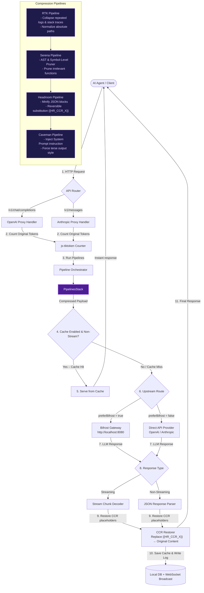
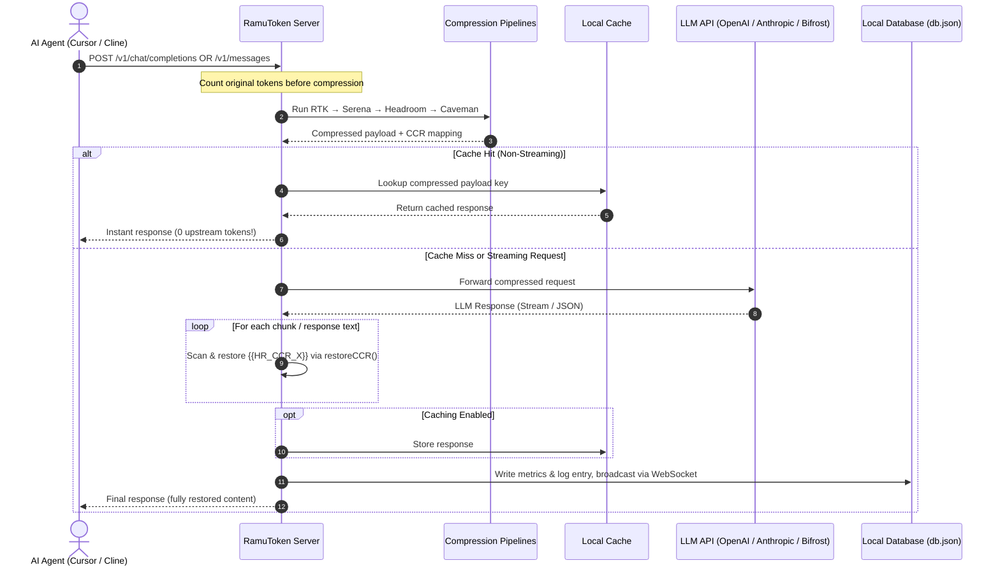

# ⚡ Token Converter & Compressor Gateway

An intelligent, highly optimized context compression proxy and gateway dashboard designed for AI coding agents (such as Cursor, Claude Code, etc.) to minimize token consumption, save API costs, and maximize prompt caching efficiency.

Built with **Bun**, **Vite**, **React**, and **Tailwind CSS v4**, this proxy integrates custom implementations of four main compression pipelines and routes payloads natively or via **Bifrost by Maxim AI** to 23+ LLM providers.

---

## 🛠️ Compression Pipelines Stack

1. **RTK (Rust Token Killer style)**: Collapses repeated CLI outputs/logs, strips formatting/ANSI escape codes, normalizes absolute system paths to clean relative routes, and prunes massive stack traces.
2. **Serena (Code AST & Symbol-Level Pruner)**: Identifies files and code blocks (JS/TS and Python), extracts search keywords from the user prompt, and prunes the bodies of methods/functions that are not directly referenced or targeted by the user query.
3. **Headroom (Structural & Reversible CCR)**: Minifies raw JSON blocks, prunes empty or blacklisted metadata fields, and substitutes long text/code segments with a short `{{HR_CCR_X}}` token (Reversible Context Substitution). It restores them in the LLM response in-flight or exposes them for retrieval.
4. **Caveman (Output Prose Optimizer)**: Injects high-density instructions into the system prompt to force the model to communicate using keywords, short sentences, and code blocks, stripping conversational fluff to save output tokens.
5. **Cache & Prompt Optimizer**: Ensures stable and deterministic compression output to maximize upstream prompt caching (e.g., Anthropic Prompt Caching), passes through cache-control markers, and provides a local memory response cache.

---

## 🗺️ Architecture & Process Flow

### Request / Response Flowchart



### Sequence Diagram



---

## 🚀 Quick Start

### Prerequisites
- [Bun](https://bun.sh) (v1.x or higher) installed.
- (Optional) [Bifrost by Maxim AI](https://github.com/maximhq/bifrost) running at `http://localhost:8080`.

### 1. Install Dependencies
```bash
bun install
```

### 2. Run in Development Mode
Starts both the backend proxy (`http://localhost:6875`) and Vite dev server (`http://localhost:5173`) concurrently with hot-reloading:
```bash
bun run dev
```

### 3. Run in Production Mode
Builds the React frontend bundle and runs the unified Bun server which serves both the proxy endpoints and the static dashboard UI on port `6875`:
```bash
bun run build
bun start
```

### 4. Run Unit Tests
Verifies the RTK, Serena, Headroom, Caveman, and Cache modules:
```bash
bun test
```

---

## 🔌 Integrating with Coding Agents

Point your AI assistant or agent to the local proxy. It exposes standard OpenAI and Anthropic compatible routes.

### Cursor / Cline / VS Code Extensions
Change the base URL of your model provider to:
```text
http://localhost:6875/v1
```
Ensure you choose the corresponding OpenAI or Anthropic model.

### Curl Example (OpenAI Format)
```bash
curl http://localhost:6875/v1/chat/completions \
  -H "Content-Type: application/json" \
  -d '{
    "model": "gpt-4o",
    "messages": [
      {
        "role": "user",
        "content": "[2026-07-01 08:35] INFO: Processing...\n[2026-07-01 08:35] INFO: Processing...\nError in C:\\Users\\User\\src\\app.ts"
      }
    ]
  }'
```

---

## 📊 Dashboard UI Features

Access the dashboard at `http://localhost:6875` (or `http://localhost:5173` in development mode):
- **Live Metrics Dashboard**: Visualizes saved tokens, compression ratios, cost savings, and cache hit rates in real-time via WebSockets.
- **Sparkline Charts**: Dynamic SVG representation of recent compression performance.
- **Pipeline Configurator**: Toggle pipelines (RTK, Serena, Headroom, Caveman, Cache) and adjust thresholds (e.g., min lines for AST pruning, min length for CCR substitution).
- **Test Bench**: Interactive playground to paste raw logs/code, type search queries, and inspect side-by-side original vs. compressed diff outputs with token metrics.
- **Logs Explorer**: Click any past request to view the full original and compressed payloads side-by-side.
